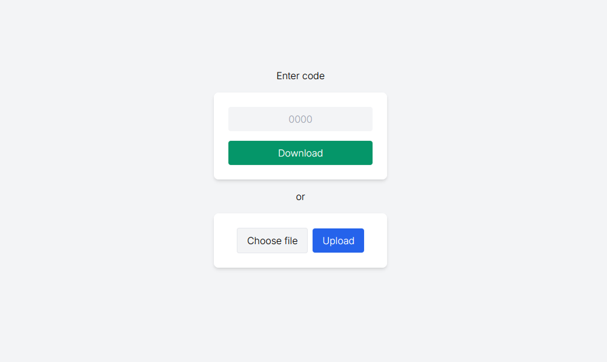

# loshare

File sharing over local networks.

## Use

This project is meant to run on a raspberry pi or similar home server.

```sh
# Create .env and fill in PORT
cenv fix

# Run
go run cmd/main.go
```

A `.dump` folder will be create and used to temporarily store files.

## Screenshots

The UI has a file upload button and download for a given file code. You will be given a code upon uploading a file. Files are deleted after a set timeout (default is 10 minutes).


